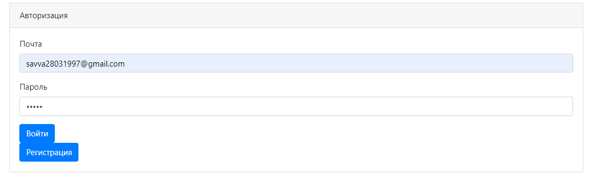
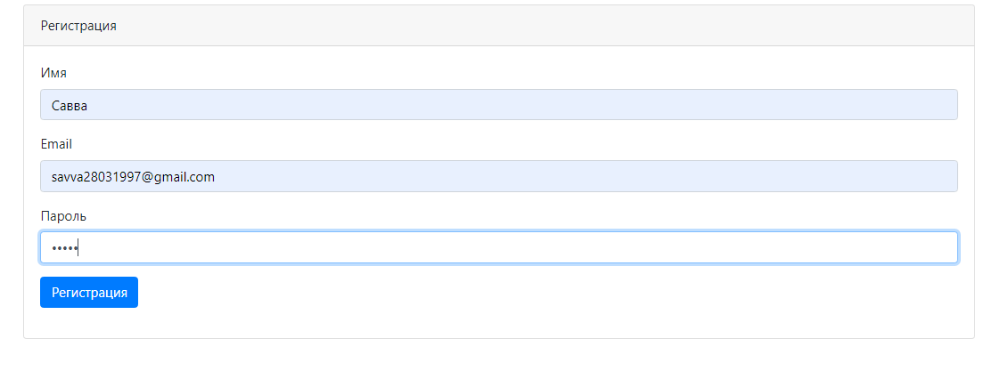
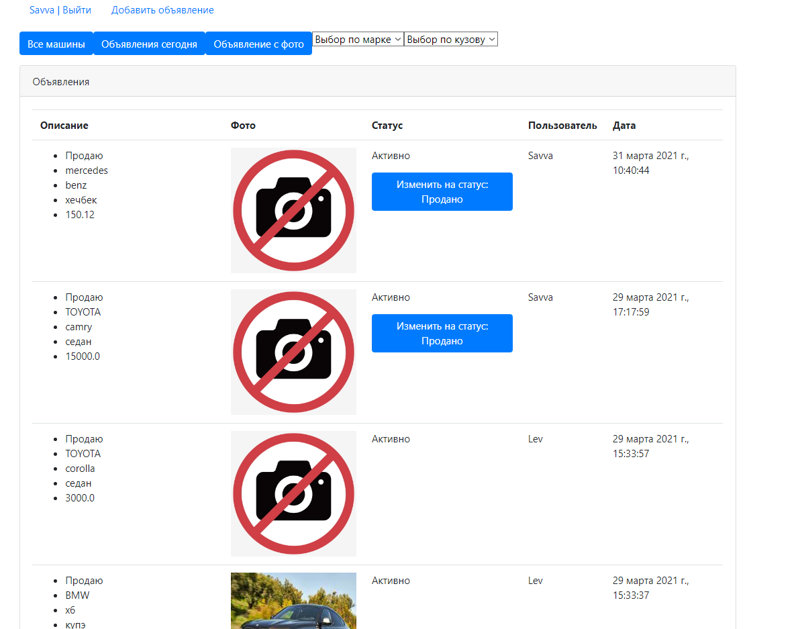
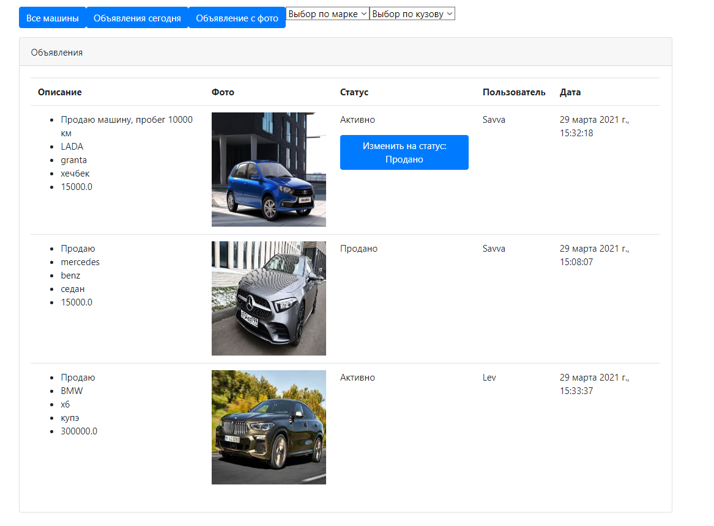
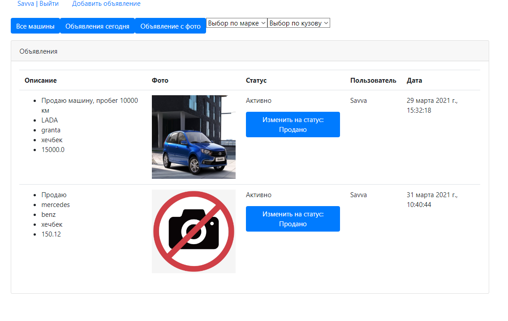
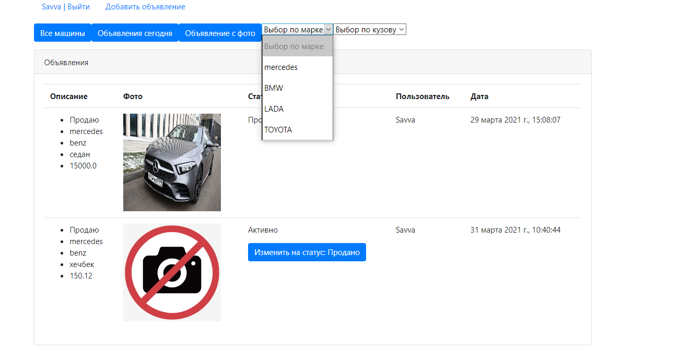
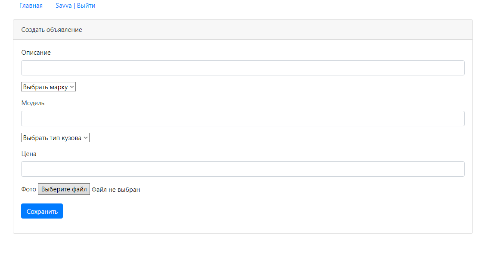

# job4j_cars

**Web Application for Automarket**

**Technologies used:**

Java, Maven, log4j, slf4j, Servlets, Hibernate, PostgreSQL, MVC Pattern, Travis CI, HTML/CSS, JS,
 Apache Tomcat, bootstrap

Регистрация:

Аутенфикация:

Все машины:

Машины c фото:

Фильтр по кузову:

Фильтр по марке:

Добавление объявления:
